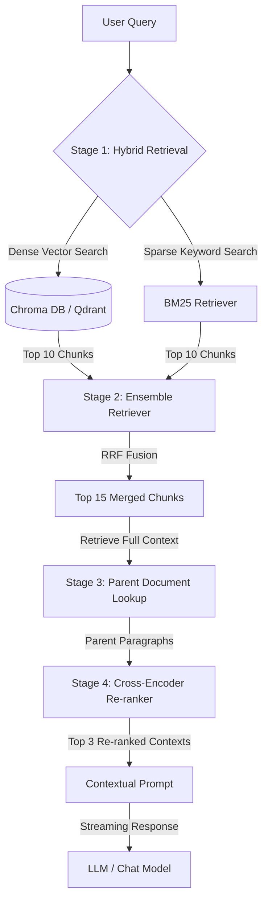

<div align="center">
  
  # 🐴 H A Y A G R I V A
  
  ### *The Editorial, SOTA Hybrid Conversational RAG Oracle*
  
  [](https://fastapi.tiangolo.com/)
  [](https://python.langchain.com/)
  [](https://www.trychroma.com/)
  [](https://ollama.com/)
  [](https://vercel.com/)

  *A local-first, cloud-serverless hybrid conversational knowledge engine engineered to resolve RAG constraints using reciprocal rank fusion, parent-document injection, and cross-encoder re-ranking.*

</div>

---

## ── Architectural Overview

Naive RAG pipelines suffer from word-matching limitations (semantic search missing exact keywords), context dilution (passing small chunks that lack surrounding context), and the "lost-in-the-middle" LLM attention degradation. 

**Hayagriva** implements a SOTA **4-Stage Retrieval & Re-ranking Pipeline** to solve these bottlenecks:



### The 4 Pipeline Stages
1.  **Stage 1: Hybrid Search:** Runs a parallel search using **Okapi BM25** (for exact keyword/phrase recall) and **Dense Embeddings** (via `all-MiniLM-L6-v2` for conceptual semantic matching).
2.  **Stage 2: Reciprocal Rank Fusion (RRF):** Merges Dense and Sparse ranking lists using RRF scoring to optimize results.
3.  **Stage 3: Parent-Document In-Metadata Injection:** Embeds small child chunks (200 chars) for precise retrieval, but stores the full parent paragraph (1000 chars) in the child chunk's metadata payload. Upon retrieval, the child chunk is swapped for its parent text, giving the LLM rich context.
4.  **Stage 4: Cross-Encoder Re-ranking:** Re-scores parent documents using `ms-marco-MiniLM-L-6-v2` to evaluate token-level joint self-attention, mitigating LLM positioning bias.

---

## ── Design Language: "Editorial Neo-Minimalism"

Hayagriva replaces default chat bubbles with an **editorial, scholarly table-of-contents layout**:

*   **Typographic Hierarchy:** Combines the luxury serif **Cormorant Garamond** (for user queries and text paragraphs) with **JetBrains Mono** (for metadata, file details, and footnote numbers) to create a clean, academic look.
*   **Tactile Animations:** Micro-interactions (hover scale transitions, pulsing state glows, and slide-in drawer menus) built with custom easing curves (`cubic-bezier(0.16, 1, 0.3, 1)`).
*   **Exegesis Panel:** Footnote citations (e.g. `[P.26]`) slide-open a side drawer displaying the verbatim text snippet used for the answer, alongside relevance scores and source document names.

---

## ── Directory Structure

```
Hayagriva/
├── data/
│   ├── documents/              # Directory for source files (.pdf, .txt, .md)
│   └── store/                  # Ingestion log cache
├── static/                     # Glassmorphic Front-End
│   ├── index.html              # Classical editorial interface
│   ├── style.css               # Obsidian & Bronze styling
│   └── app.js                  # SSE Stream receiver
├── src/                        # FastAPI Application
│   ├── config.py               # Settings manager (loads environment)
│   ├── vector_store.py         # Embedding & database configurations
│   ├── reranker.py             # Local Cross-Encoder re-ranker
│   ├── ingest.py               # Incremental byte-level ingester
│   └── api.py                  # API endpoints and SSE streams
├── main.py                     # Entry point
├── vercel.json                 # Vercel deployment spec
└── requirements.txt            # Project dependencies
```

---

## ── Quick Start

### 1. Installation
```bash
git clone https://github.com/your-username/Hayagriva.git
cd Hayagriva

# Initialize virtualenv
python3 -m venv venv
source venv/bin/activate
pip install -r requirements.txt
```

### 2. Ollama Pull (Local LLM)
Make sure [Ollama](https://ollama.com/) is running:
```bash
ollama pull qwen3.5:2b
```

### 3. Run Ingestion (Local)
Place your PDFs inside `data/documents/` and index them:
```bash
python -m src.ingest
```

### 4. Launch the Server
```bash
python main.py
```
Open **`http://localhost:8000`** in your browser.

---

## ── API Reference

### `POST /api/chat`
Streams LLM completion tokens and source metadata.
*   **Request Body:**
    ```json
    { "message": "What is morality?", "session_id": "session-123" }
    ```
*   **Response Stream:** `text/event-stream` yielding events `sources`, `token`, and `done`.

### `POST /api/upload`
Uploads and indexes a new document at runtime.
*   **Request Type:** `multipart/form-data`
*   **Payload:** `file: UploadFile`

### `GET /api/documents`
Lists all currently indexed files.
*   **Response:**
    ```json
    { "documents": [ { "filename": "kant.pdf", "hash": "6bd5d6..." } ] }
    ```

---

## ── Serverless Vercel Deploy

Hayagriva automatically switches to **Cloud Mode** when it detects a `GEMINI_API_KEY` in the environment, bypassing local heavy libraries (like PyTorch and Ollama) to run serverlessly.

1.  Import your GitHub repository to **Vercel**.
2.  Set the following **Environment Variables**:
    *   `GEMINI_API_KEY`: Your Google Gemini Key (Required).
    *   `QDRANT_URL`: Your Qdrant Cloud Cluster endpoint (Required for dynamic uploads).
    *   `QDRANT_API_KEY`: Your Qdrant Cloud API key.
3.  Deploy. Vercel will host the FastAPI server and front-end assets on the free tier.
